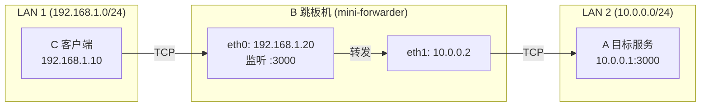

# mini-forwarder

高性能 TCP 端口转发服务，适用于跳板机 / 内网穿透场景。

## 架构



- **LAN 1**（办公网）：C 和 B 在同一网段，C 可访问 B
- **LAN 2**（数据中心）：B 和 A 在同一网段，B 可访问 A
- **B 双网卡**：eth0 接 LAN 1，eth1 接 LAN 2，做桥接
- **C 无法直接访问 A**，通过 B 中转

### 典型场景

1. **开发访问内网服务**：开发机在办公网，需要连接数据中心的数据库/缓存
2. **跨 VPC 转发**：云环境中两个 VPC 不互通，通过堡垒机桥接
3. **网络安全隔离**：安全策略要求间接访问，B 作为受控网关

## 特性

- 全双工 TCP 转发 (`io.Copy` + `CloseWrite` 半关闭)
- 多端口映射，YAML 配置管理
- 配置热加载 (fsnotify)
- 优雅退出 (SIGINT/SIGTERM)
- SIGHUP 触发配置重载
- 连接级指数退避重试
- TCP KeepAlive + TCP_NODELAY
- 空闲连接超时检测
- 结构化日志 (zap)
- 防止 goroutine 泄漏 (WaitGroup 追踪)
- 防止 fd 泄漏 (defer close + 超时兜底)

## 快速开始

### 编译

```bash
make build
```

### 配置

编辑 `configs/forwarder.yaml`:

```yaml
forwards:
  - name: "app"
    listen: ":3000"
    target: "10.0.0.1:3000"

  - name: "redis"
    listen: ":6379"
    target: "10.0.0.1:6379"
```

### 运行

```bash
./mini-forwarder -config configs/forwarder.yaml
```

### 查看版本

```bash
./mini-forwarder -version
```

## 配置参数

### 全局参数

| 参数 | 类型 | 默认值 | 说明 |
|------|------|--------|------|
| `log_level` | string | `info` | 日志详细程度。`debug` 记录所有转发细节（含每条连接的生命周期）；`info` 只记录启动/关闭/错误；`warn`/`error` 仅记录异常 |
| `log_format` | string | `json` | 输出格式。`json` 适合生产环境（方便 ELK/Loki 采集）；`console` 适合开发调试（人类可读、带颜色） |
| `hot_reload` | bool | `true` | 是否监听配置文件变更并自动应用。修改 YAML 后无需重启服务，新规则立即生效，旧规则平滑过渡 |
| `shutdown_timeout` | duration | `30s` | 收到 SIGINT/SIGTERM 后，最多等待多久让现有连接自然结束。超时后强制退出，未传完的数据会丢失 |

### 转发规则参数

> 以下参数以 **C → B → A** 场景说明：B 运行 mini-forwarder，C 是客户端，A 是目标服务。

| 参数 | 类型 | 默认值 | 说明 |
|------|------|--------|------|
| `name` | string | 必填 | 规则名称，仅用于日志和标识。同文件内不能重复。推荐用服务名+端口号，如 `app-3000` |
| `listen` | string | 必填 | B 上监听的地址和端口。`:3000` 表示 B 上所有网卡都监听；`127.0.0.1:3000` 表示仅本机可访问。**C 连的就是这个地址** |
| `target` | string | 必填 | A 的地址和端口。**B 会把流量转发到这里**。必须是 C 无法直接访问但 B 可以访问的地址 |
| `dial_timeout` | duration | `10s` | 当 C 连上 B 后，B 尝试连接 A 的最长等待时间。超时说明 A 不可达或端口未开放，B 会断开 C 的连接 |
| `idle_timeout` | duration | `300s` | 连接建立后，如果持续 5 分钟没有任何数据传输，B 会主动断开这条连接，释放资源。设为 `"0"` 则永不超时（适合 Redis、MySQL 等长连接服务） |
| `max_retries` | int | `3` | C 连上 B 后，B 连 A 失败时的重试次数。共尝试 `max_retries + 1` 次。所有尝试都失败后，B 才会断开 C 并返回错误 |
| `retry_interval` | duration | `1s` | 第一次重试前等待 1 秒，之后每次翻 1.5 倍（指数退避），上限 10 秒。避免 A 短暂故障时反复重试造成雪崩 |
| `keep_alive` | duration | `30s` | 每 30 秒发送一次 TCP KeepAlive 探测包，用于检测连接是否还活着（比如 A 掉线、防火墙静默丢包）。发现死连接后立即释放 |

### 环境变量

所有参数均可通过环境变量覆盖，前缀 `FORWARDER_`:

```bash
FORWARDER_LOG_LEVEL=debug FORWARDER_HOT_RELOAD=false ./mini-forwarder
```

## 部署

### systemd

```bash
# 安装
sudo cp mini-forwarder /usr/local/bin/
sudo cp configs/forwarder.yaml /etc/mini-forwarder/
sudo cp deployments/mini-forwarder.service /etc/systemd/system/

# 启动
sudo systemctl daemon-reload
sudo systemctl enable mini-forwarder
sudo systemctl start mini-forwarder

# 查看日志
journalctl -u mini-forwarder -f

# 重载配置
sudo systemctl reload mini-forwarder   # 或 kill -HUP <PID>
```

### Docker

```bash
docker build -f deployments/Dockerfile -t mini-forwarder .
docker run -d \
  --name mini-forwarder \
  --network host \
  -v /path/to/forwarder.yaml:/etc/mini-forwarder/forwarder.yaml:ro \
  mini-forwarder
```

## 项目结构

```
mini-forwarder/
├── cmd/mini-forwarder/     # 入口
├── internal/
│   ├── config/              # 配置加载与校验
│   ├── forwarder/           # 核心转发引擎
│   └── logger/              # 日志初始化
├── configs/                 # 配置文件示例
├── deployments/
│   ├── Dockerfile
│   └── mini-forwarder.service
├── Makefile
└── go.mod
```

## 性能优化建议

1. **关闭 Nagle 算法**: 已内置 `SetNoDelay(true)`，减少小包延迟
2. **调整系统参数**:
   ```bash
   # 增加文件描述符限制
   ulimit -n 65535

   # 调整内核 TCP 参数
   sysctl -w net.ipv4.tcp_tw_reuse=1
   sysctl -w net.ipv4.tcp_fin_timeout=15
   sysctl -w net.somaxconn=4096
   sysctl -w net.ipv4.tcp_max_syn_backlog=4096
   ```
3. **空闲超时**: 长连接服务 (如 Redis) 建议设为 `0` 禁用
4. **日志级别**: 生产环境使用 `info`，排查问题时临时切到 `debug`

## 生产环境注意事项

1. **资源限制**: systemd 服务已配置 `LimitNOFILE=65535`，Docker 使用 `--network host`
2. **安全加固**: 不对外暴露管理端口，配置文件权限设为 `600`
3. **监控**: 通过日志监控 `active_conn` 指标，异常飙升时告警
4. **高可用**: 转发服务本身无状态，可用 keepalived/VIP 做主备
5. **TLS**: 如需加密传输，建议在 A 或 C 侧使用 stunnel/tlsproxy 包装

## 常见问题

### TIME_WAIT 堆积

短连接场景下 B 主动关闭连接会产生 TIME_WAIT。解决方案:
- 系统层: `net.ipv4.tcp_tw_reuse=1` (允许复用)
- 应用层: 使用连接池 (客户端侧)
- 架构层: 使用长连接协议

### 半连接队列溢出

高并发短连接时 SYN 队列可能溢出:
- `net.ipv4.tcp_max_syn_backlog=4096`
- `net.core.somaxconn=4096`
- 应用层启用 SYN cookies: `net.ipv4.tcp_syncookies=1`

### 连接泄漏

本项目通过 `sync.WaitGroup` 追踪每个活跃连接，并在关闭时等待所有连接排空。同时使用空闲超时兜底，防止僵死连接占用资源。

## License

MIT
